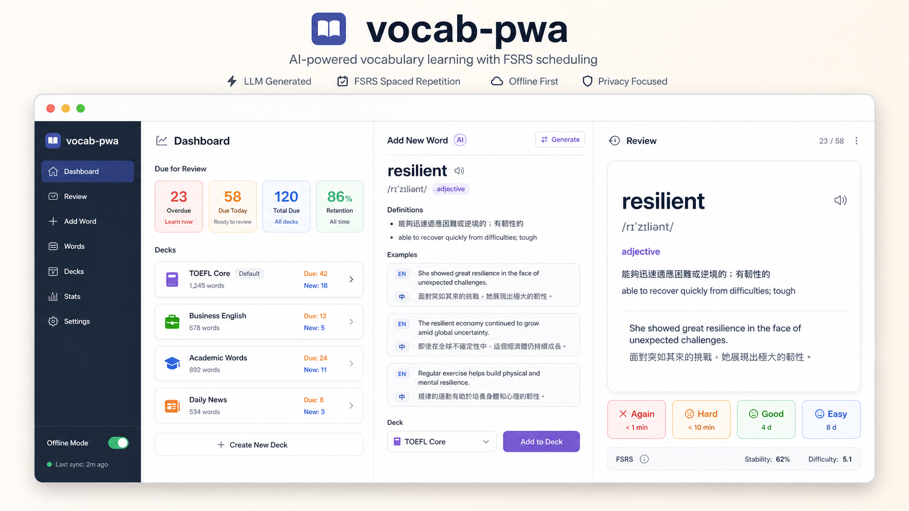

# vocab-pwa

`vocab-pwa` is a multi-deck vocabulary review PWA. It uses FSRS scheduling, Firebase as the backend platform, and an LLM provider to generate bilingual vocabulary content.

## Project Status

This project is built for personal use and small beta deployments. It is not a hosted SaaS product. If you open sign-up to public users, add per-user quotas for LLM and speech endpoints before relying on it in production.

Production deployments should use Firebase App Check, Firebase Auth, budget alerts, and restricted access to any paid LLM or TTS providers.

## Screenshots



The demo image is a generated design target mockup for the README, not a live application screenshot. It illustrates the intended dashboard, AI-assisted word creation, and FSRS review flow without exposing production data. Pull requests that materially change the UI should include GitHub-hosted screenshots in the PR description rather than committing review screenshots to the repository.

## Quick Start

Install dependencies:

```sh
npm install
```

Create local environment files from `.env.example`, then fill in your Firebase and LLM provider values:

```sh
cp .env.example .env.local
cp .env.example apps/web/.env.local
```

Start the Firebase emulators:

```sh
npm run dev:functions
```

Start the frontend in another terminal:

```sh
npm run dev:web
```

Open:

```txt
http://127.0.0.1:5173/
```

See [Environment Variables](#environment-variables) and [Firebase Setup](#firebase-setup) for the full Firebase/Auth/App Check setup.

## Features

- Multiple vocabulary decks, called sections in the API.
- Add a word with LLM-generated parts of speech, Traditional Chinese definitions, English definitions, and bilingual example sentences.
- Review flow similar to Anki: front side shows the English word, back side shows definitions and examples.
- Four FSRS ratings: `Again`, `Hard`, `Good`, `Easy`.
- Paginated card loading to avoid fetching an entire deck at once.
- Delete decks and delete individual cards.
- PWA build with offline app shell and IndexedDB cache/queue scaffolding.
- Email/password sign-in through Firebase Auth, with per-user Firestore data isolation.
- Offline review queue that syncs after reconnecting or signing in again.
- Switchable LLM providers: OpenRouter, Groq, and Gemini.

## Stack

- React + TypeScript + Vite
- Firebase Hosting
- Firebase Functions v2 HTTP API
- Cloud Firestore
- Firebase Emulator Suite for local development
- `ts-fsrs` for spaced repetition scheduling
- Zod validation for API and LLM output contracts

## Usage Limits and Billing

Firebase Hosting can serve the frontend on the Spark plan, but production Firebase Functions require the Blaze plan. Blaze is pay-as-you-go with no-cost usage quotas for several services; budget alerts notify you about spend but do not cap usage automatically.

See [Firebase and LLM Usage Limits](docs/usage-limits.md) for the project-specific cost map, rough review/card-generation usage math, and budget alert setup.

Public deployments should add per-user quotas for `/api/generate-word` and `/api/speech`; App Check reduces non-app traffic but does not replace authorization or rate limiting.

## FSRS Configuration

The backend uses a centralized FSRS configuration in `functions/src/fsrs-config.ts`.

- Desired retention starts at `0.9`.
- Short-term scheduling is enabled with same-day learning and relearning steps: `["10m"]`.
- Existing cards are not automatically rescheduled when FSRS settings change.
- Personalized parameter optimization should wait until at least `1000` effective reviews.
- Parameter optimization should be treated as a periodic operation, roughly every `30` days.

These defaults follow the project's current needs: predictable vocabulary review load, no long learning steps, and no surprise backlog spikes from mass rescheduling.

## Project Structure

```txt
apps/web/          React PWA frontend
functions/         Firebase Functions API
packages/shared/   Shared TypeScript types and schemas
firebase.json      Firebase hosting/functions/firestore config
firestore.rules    Firestore client access rules
firestore.indexes.json
```

## Environment Variables

The root `.env.example` documents the variables used by the project:

```env
LLM_PROVIDER=openrouter
LLM_MODEL=meta-llama/llama-4-maverick:free
LLM_API_KEY=
LLM_DEBUG_LOGS=false
ALLOWED_ORIGINS=http://localhost:5173
AUTH_DISABLED_FOR_DEV=false
VITE_API_BASE_URL=http://127.0.0.1:5001/YOUR_PROJECT_ID/us-central1/api/api
VITE_FIREBASE_API_KEY=
VITE_FIREBASE_AUTH_DOMAIN=YOUR_PROJECT_ID.firebaseapp.com
VITE_FIREBASE_PROJECT_ID=YOUR_PROJECT_ID
VITE_FIREBASE_APP_ID=
VITE_USE_AUTH_EMULATOR=false
VITE_RECAPTCHA_SITE_KEY=
VITE_APPCHECK_DEBUG_TOKEN=
```

For local development, create:

```txt
apps/web/.env.local
.env.local
.secret.local
```

Example `apps/web/.env.local`:

```env
VITE_API_BASE_URL=http://127.0.0.1:5001/YOUR_PROJECT_ID/us-central1/api/api
VITE_FIREBASE_API_KEY=<your-web-api-key>
VITE_FIREBASE_AUTH_DOMAIN=YOUR_PROJECT_ID.firebaseapp.com
VITE_FIREBASE_PROJECT_ID=YOUR_PROJECT_ID
VITE_FIREBASE_APP_ID=<your-firebase-web-app-id>
VITE_USE_AUTH_EMULATOR=true
VITE_RECAPTCHA_SITE_KEY=<your-recaptcha-v3-site-key>
VITE_APPCHECK_DEBUG_TOKEN=true
```

`VITE_API_BASE_URL` is only used by the frontend in Vite dev mode. Production builds always call same-origin `/api`, which Firebase Hosting rewrites to the deployed Function. Do not set a production `VITE_API_BASE_URL` unless the API is intentionally hosted outside Firebase Hosting.

`VITE_FIREBASE_APP_ID` is required by Firebase App Check. Without it, App Check token exchange requests target `apps/undefined` and fail. `VITE_RECAPTCHA_SITE_KEY` enables Firebase App Check for live API requests using the reCAPTCHA v3 provider. `VITE_APPCHECK_DEBUG_TOKEN=true` is only read in local dev builds; the browser console prints a debug token that must be registered in Firebase Console > App Check. Do not commit real App Check debug tokens.

The backend requires every `/api` request to include a valid `X-Firebase-AppCheck` token before Firebase Auth is checked. Direct curl/script requests without App Check are rejected before they can call LLM, speech, or Firestore logic.

Example root `.env.local` for Functions:

```env
LLM_PROVIDER=groq
LLM_MODEL=llama-3.3-70b-versatile
LLM_DEBUG_LOGS=false
ALLOWED_ORIGINS=http://localhost:5173,http://127.0.0.1:5173
AUTH_DISABLED_FOR_DEV=false
```

Example root `.secret.local`:

```env
LLM_API_KEY=<your-provider-api-key>
```

Do not commit `.env.local`, `.env.<project>`, or `.secret.local` files.

## Local Development

Install dependencies:

```sh
npm install
```

Start the Firebase emulators:

```sh
npm run dev:functions
```

Start the frontend in another terminal:

```sh
npm run dev:web
```

Open:

```txt
http://127.0.0.1:5173/
```

The Firebase Emulator UI is usually available at:

```txt
http://127.0.0.1:4000/
```

The Auth emulator runs on:

```txt
http://127.0.0.1:9099/
```

The local API URL shape is:

```txt
http://127.0.0.1:5001/YOUR_PROJECT_ID/us-central1/api/api
```

The repeated `/api/api` is expected:

- first `api`: Firebase function name
- second `/api`: Express route prefix

## Firebase Setup

Install and log in to Firebase CLI:

```sh
npm install -g firebase-tools
firebase login
```

Create or select a Firebase project:

```sh
firebase use --add
```

Enable Cloud Firestore in Firebase Console. Use production mode. This project does not let the browser access Firestore directly; all database writes go through Firebase Functions.

Enable Firebase Authentication and the Email/Password provider. Any signed-in Firebase user can use the app; API reads and writes are scoped by that user's Firebase UID.

For local development with the Auth emulator, create the same test user in the Emulator UI or by using Firebase tooling. You can set `AUTH_DISABLED_FOR_DEV=true` only while running the Functions emulator; production Functions reject this shortcut and require a valid Firebase ID token.

Firebase emulators require Java 21 or newer. Check your current Java:

```sh
java -version
echo $JAVA_HOME
```

On macOS with Homebrew:

```sh
brew install openjdk@21
export JAVA_HOME="$(brew --prefix openjdk@21)"
export PATH="$JAVA_HOME/bin:$PATH"
```

Then run:

```sh
npm run dev:functions
```

If your global Java is older and you only want to use Java 21 for one command, run:

```sh
JAVA_HOME=/opt/homebrew/opt/openjdk@21 npm run dev:functions
```

## Firestore Model

Collections:

- `sections`: decks
- `cards`: vocabulary cards
- `reviewLogs`: review history
- `settings`: app-level settings

New writes include `ownerUid` for per-user data isolation. Sections and cards use `archivedAt` for soft deletion, and review logs include `clientReviewId` so retried offline reviews are idempotent.

If you already have production documents without `ownerUid`, run the owner backfill before deploying the owner-scoped API. The script defaults to dry-run:

```sh
BACKFILL_OWNER_UID=<firebase-auth-user-uid> npm run backfill:owner -w functions
```

After checking the printed counts, run the write:

```sh
BACKFILL_OWNER_UID=<firebase-auth-user-uid> BACKFILL_OWNER_DRY_RUN=false npm run backfill:owner -w functions
```

The backfill updates legacy `sections`, `cards`, and `reviewLogs` that do not have `ownerUid`, sets missing `archivedAt` to `null` on sections/cards, and copies `settings/global` to `settings/<uid>`.

The browser is blocked from direct Firestore access by `firestore.rules`:

```js
allow read, write: if false;
```

Firebase Functions uses the Admin SDK and is not blocked by these rules.

## API Overview

- `GET /api/dashboard`
- `GET /api/settings`
- `PUT /api/settings`
- `GET /api/sections`
- `POST /api/sections`
- `DELETE /api/sections/:sectionId`
- `POST /api/generate-word`
- `POST /api/cards`
- `GET /api/cards?sectionId=<id>&dueBefore=<iso>&limit=<n>&cursor=<cursor>`
- `DELETE /api/cards/:cardId?sectionId=<id>`
- `POST /api/reviews`

Live API requests require `Authorization: Bearer <Firebase ID token>`. Missing, invalid, or expired tokens return `401`. Valid Firebase users can use the API, and data is scoped by token UID.

`POST /api/reviews` requires a client-generated `clientReviewId`. If the same review is retried after reconnecting, the backend returns the original `nextDue` without applying FSRS a second time.

Review ratings mirror `ts-fsrs` numeric values:

```ts
export enum ReviewRating {
  Again = 1,
  Hard = 2,
  Good = 3,
  Easy = 4,
}
```

## LLM Providers

Set `LLM_PROVIDER` to one of:

- `openrouter`
- `groq`
- `gemini`

For Groq, `llama-3.3-70b-versatile` uses JSON Object Mode. `meta-llama/llama-4-scout-17b-16e-instruct` uses JSON Schema mode with `strict: false`.

All LLM output is validated by the backend before it is returned to the frontend. Invalid output is retried once and then returned as a `422`.

## Debug Logging

`LLM_DEBUG_LOGS=true` prints raw LLM responses in the Functions log:

```env
LLM_DEBUG_LOGS=true
```

This does not print the API key, but it may print user-entered words and generated content. Keep it `false` in production unless you are actively debugging.

## Emulator vs Production

Firestore emulator data is local test data. It does not appear in Firebase Console and does not sync to production Firestore.

During local development:

```txt
Browser -> Vite dev server -> Functions emulator -> Firestore emulator
```

The LLM provider still uses the real external API unless you switch back to the frontend mock mode.

Production flow:

```txt
Browser -> Firebase Hosting -> /api/** rewrite -> Firebase Functions -> Cloud Firestore / LLM provider
```

## Deploy

For local emulator development, secrets can live in `functions/.secret.local`.

For production, prefer Firebase Secret Manager on Blaze:

```sh
firebase functions:secrets:set LLM_API_KEY
```

If you are intentionally not using Secret Manager, set the production Functions env file in the repository root. The filename must match the selected Firebase project alias or project ID, for example:

```txt
.env.dev
.env.YOUR_PROJECT_ID
```

Required production values include:

```env
LLM_PROVIDER=groq
LLM_MODEL=llama-3.3-70b-versatile
LLM_API_KEY=<your-provider-api-key>
GROQ_API_KEY=<your-groq-api-key-for-speech>
ALLOWED_ORIGINS=https://YOUR_PROJECT_ID.web.app,https://YOUR_PROJECT_ID.firebaseapp.com
AUTH_DISABLED_FOR_DEV=false
```

No production allow-list UID is required. Access is controlled by Firebase Auth and per-user `ownerUid` scoping in Functions.

The production frontend should not set `VITE_API_BASE_URL`. Built Hosting assets call same-origin `/api`, and Firebase Hosting rewrites those requests to the deployed `api` Function. `VITE_API_BASE_URL` is only for Vite dev mode or for intentionally hosting the API outside Firebase Hosting.

Deploy frontend-only changes, such as `apps/web/src/*`, styles, or frontend env changes:

```sh
npm run build -w apps/web
firebase deploy --only hosting
```

Deploy backend, shared package, Firestore, or Firebase config changes, such as `functions/src/*`, `packages/shared/*`, `firebase.json`, `firestore.rules`, or `firestore.indexes.json`:

```sh
npm run build
firebase deploy
```

If Firebase asks how many days to keep container images before deletion, `7` is a reasonable default for this project:

```txt
How many days do you want to keep container images before they're deleted?
7
```

Cloud Functions usually requires the Firebase Blaze plan. Firestore has free quotas, but production usage should still be monitored with budget alerts.

## Scripts

```sh
npm run dev:web        # Vite frontend
npm run dev:functions  # Firebase emulators
npm run build          # Build all workspaces
npm run test           # Run tests
npm run test:integration -w functions  # Firestore emulator integration tests
npm run deploy         # firebase deploy
```

## Security Notes

- Never commit `.env.local`, `.secret.local`, Firebase debug logs, or service account files.
- The frontend should not contain LLM API keys.
- Firestore is intentionally accessed through Functions, not directly from the browser.
- Firebase App Check is required for live API requests.
- Live Functions require Firebase Auth ID tokens and scope Firestore data by token UID.
- The frontend never stores the email/password. Firebase Auth manages the session and token refresh.
- Offline pending reviews remain in IndexedDB when a token expires; after the next successful login, the app syncs them before refreshing the dashboard.
- Keep `LLM_DEBUG_LOGS=false` in production.

## License

MIT. See [LICENSE](LICENSE).
